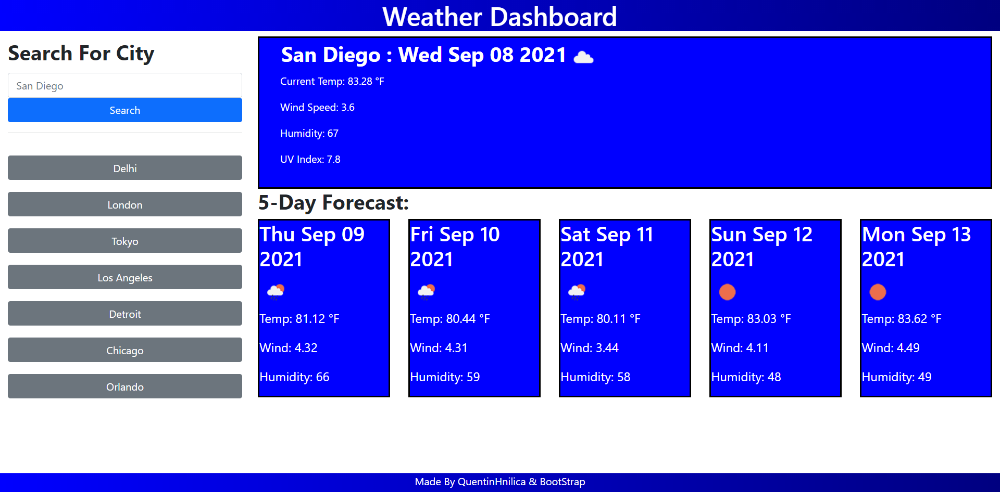

# weather-dashboard
Week 5 HomeWork Assignment

## How to use
1. Open this link: [Github Pages Link](https://quentinhnilica.github.io/weather-dashboard/)
2. Enter the city name you want to check the weather for.
3. Click search and the weather will be displayed, and your search will be saved to a button for quick research 
4. Refresh the page and your recent search will be saved to the buttons
5. Your first visit will have suggested cities, but your search will over-ride those suggestions.

## Design 
- Used bootstrap for styling the page.

## Features
- All inputed data will be saved
- Search any major city in the world

## Languages Used
- JavaScript (Logic)
- HTML (Bones of site)
- Bootstrap (Styling)
- Css (For minor Tweeks)
